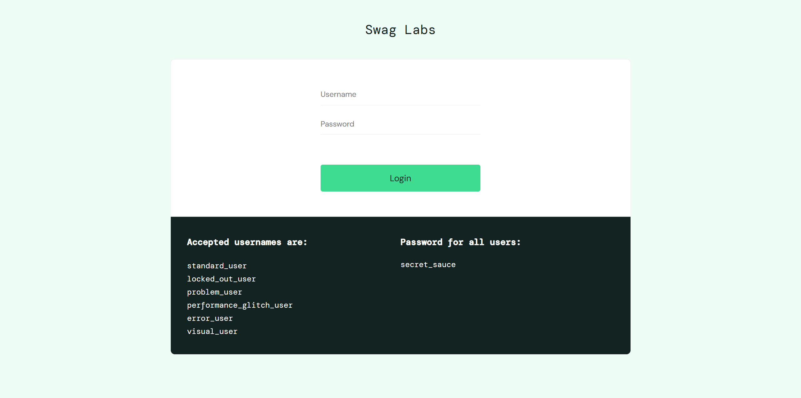

This is an automation exercise made on https://www.saucedemo.com/  
Following test scenarios were tested:  
-> login; add 1 product to cart; inspect cart content; fill in checkout details; check total without tax; check order completion message  
-> login; add multiple different products to cart (site does not allow same product to be added multiple times);  
   inspect cart content; fill in checkout details; check total without tax; check order completion message  
-> attempt login using wrong credentials; check error message  
-> attempt login using blocked account; check error message  
-> attempt to partially fill checkout information; check error message  
  
The tests were grouped into two suites:   
-> ErrorValidationTests  
-> SubmitOrderTests  
A Master-suite.xml was also added to run both suites with one command  
  
In order to run the test suite:  
cd repoLocation //set location to the repository  
mvn test -DsuiteXmlFile=testSuites/Master-suite.xml //run Master-suite  
start "" "reports/index.html" //view report in browser  

