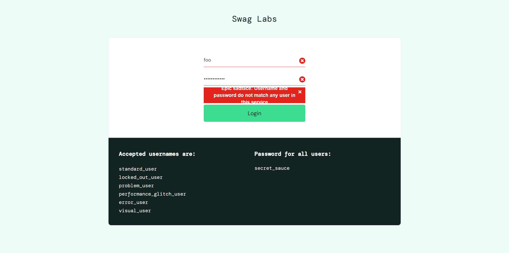

This is an automation exercise made on https://www.saucedemo.com/  
  
!In order to run the project, the following are required:  
-Install Java (JDK 11 or Later)  
-Install Maven  
  
Commands to run the project
cd repoLocation //set location to the downloaded files  
mvn test -DsuiteXmlFile=testSuites/Master-suite.xml //run Master-suite  
start "reports/index.html" //view report in browser  

